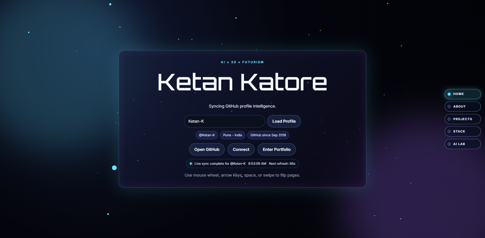

<div align="center">

# VibeFolio

### ✨ AI × 3D × Futurism for live GitHub profiles


Live GitHub portfolio built with Angular 21. VibeFolio turns public GitHub data into a cinematic multi-page interface with page flips, glass panels, animated metrics, and a lightweight AI-style command surface. 🚀



</div>

---

## 📡 Signal Snapshot

VibeFolio is not a static portfolio template. It behaves like a live profile console.

- Load any public GitHub username from the hero input or command console 👤
- Render About, Projects, Skills, and AI Lab from live GitHub data 🌐
- Navigate with wheel, keys, touch, side links, query params, and `#section` fragments 🧭
- Preserve the last selected username in local storage 💾
- Keep the interface style consistent across different GitHub profiles 🎛️

```text
Boot target: http://localhost:4200/?user=Ketan-K#projects
```

## 🗺️ Experience Map

### 🏠 Home

Launch page with username loading, live sync state, GitHub CTA, and fast entry into the portfolio flow.

### 🧬 About

Profile intelligence panel with metadata, social links, and animated stat counters.

### 🛰️ Projects

Repository analytics, horizontally scrollable featured repository rail, pinned-style cards, and recent public GitHub activity.

### ⚡ Skills

Animated stack breakdown with language share bars and a generated topic cloud from repository metadata.

### 🤖 AI Lab

Local command console for profile switching, section jumps, summarization, and contact shortcuts.

## 🧭 Navigation Modes

The app supports multiple navigation paths so the experience feels like an interface, not a document.

- Mouse wheel page flips with inner-scroll protection for long panels 🖱️
- Keyboard navigation with arrow keys, Page Up, Page Down, and Space ⌨️
- Touch swipe navigation 📱
- Side navigation with labeled hash links 🔗
- Deep links via URL fragments:
	- `#home`
	- `#about`
	- `#projects`
	- `#skills`
	- `#ai-lab`

## 🧠 Command Surface

The AI Lab is a local command interpreter. It does not call an LLM.

Supported commands:

- `set user octocat`
- `load user torvalds`
- `switch user Ketan-K`
- `go to home`
- `go to about`
- `go to projects`
- `go to skills`
- `go to ai`
- `summarize profile`
- `open github`
- `contact`
- `email`

Example flow:

```text
> set user torvalds
> go to projects
> summarize profile
```

## 🎨 Visual Language

The app styling is built around the same cues throughout the experience:

- dark radial space backdrop 🌌
- soft scanlines and drifting aura layers 🌫️
- glass panels with animated conic highlights 💠
- Orbitron-led display typography 🔠
- cyan and violet signal accents 🔵
- animated counters, bars, and panel transitions ✨

## 🛠️ Stack

- Angular 21 standalone components
- TypeScript
- Sass
- Tailwind CSS 4
- GitHub REST API

## 🚀 Boot Sequence

Install and run locally:

```bash
npm install
npm start
```

Default local address:

```text
http://localhost:4200/
```

Other useful commands:

```bash
npm run build
npm run test
npm run watch
```

## 👤 Profile Resolution Order

On startup, the active GitHub user is resolved in this order:

1. `?user=<github-username>` query parameter
2. last saved user from local storage
3. fallback default: `Ketan-K`

When a new username is loaded, the app updates the `user` query parameter and saves it locally for the next visit.

## 🧱 Project Layout

- `src/index.html` Angular document shell
- `src/app/app.ts` runtime state, navigation, AI commands, and GitHub sync
- `src/app/app.html` section composition
- `src/app/github.service.ts` GitHub API access layer
- `src/app/components/` standalone page and UI components
- `src/app/directives/animate-number.directive.ts` animated numeric display directive
- `src/styles.scss` design tokens, layout system, and global motion
- `.github/workflows/deploy-pages.yml` GitHub Pages deployment workflow

## 🚢 Deployment Uplink

This repository already includes a GitHub Actions workflow for GitHub Pages.

One-time setup:

1. Open repository Settings > Pages.
2. Set Source to GitHub Actions.
3. Ensure the deployment runs from the `main` branch workflow.

Deployment behavior:

- Push to `main` to deploy automatically
- Or trigger the workflow manually from the Actions tab
- The workflow computes the correct `base-href`
- Repositories ending with `.github.io` build with `/`
- Other repositories build with `/<repo-name>/`

## 📌 Operational Notes

- GitHub API rate limits apply because requests are unauthenticated
- Public email, blog, and social links only appear when exposed on the GitHub profile
- Skills and featured repository views depend on GitHub repository metadata

## 📄 License

Released under the MIT License. See `LICENSE`.
